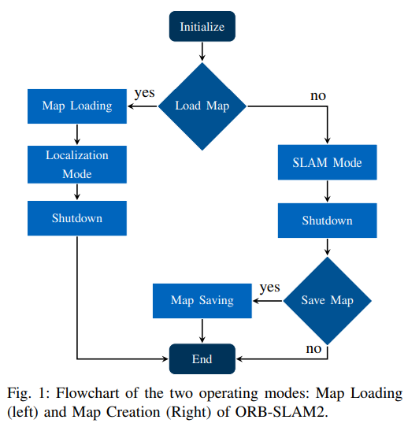
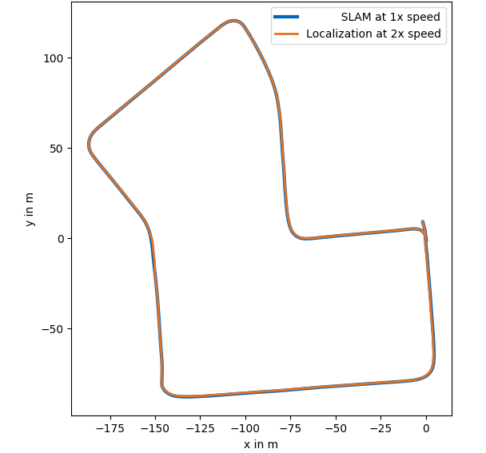
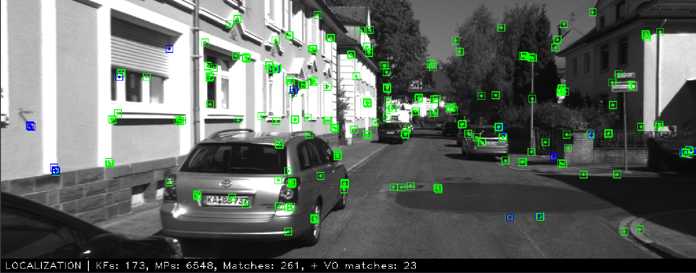

# ORB-SLAM2 map saving and loading for closed circuit localization

This project provides a ROS package for localization of an autonomous vehicle. The localization is based on a map consisting of ORB features. The mapping and localization module is taken from the <a href="https://github.com/raulmur/ORB_SLAM2">ORB-SLAM2</a> implementation. Our project builds on top of the [ROS-enabled version](https://gitlab.tu-berlin.de/breakdowncookie/ORB_SLAM2). In this extensions the map of ORB-features be saved to the disk as a reference for future runs along the same track. At high speeds, a map-based localization, may be prefered over a full SLAM due to better localization accuracy and global positioning reference. The use-case for the presented system is a closed circuit racing scenario. In a first step, we create a map at low speeds with a full SLAM. In further runs at higher speeds, we localize on the previously saved map to increase the localization accuracy. The usage is demonstrated with an example from the KITTI dataset. The flow chart of the extended functionality is shown in Figure 1.

<p align="center">
  
</p>


## Installation of Dependencies

The system is tested on **Ubuntu 16.04**.
The system is depended on the following libraries as used by the original ORB-SLAM2 implementation:

#### OpenCV

We use [OpenCV](http://opencv.org) to manipulate images and features. Dowload and install instructions can be found at: http://opencv.org. **Required at leat 2.4.3. Tested with OpenCV 2.4.11 and OpenCV 3.2**.

#### Eigen3

Required by g2o. Download and install instructions can be found at: http://eigen.tuxfamily.org. **Required at least 3.1.0**.

#### ROS

ROS is required with this extended version since it offers the ORB-SLAM2 functionality in form of a ROS package and uses topic broadcasts to publish information for the camera position as a `TransformationFrame`, map points as `PointCloud` and the tracking state as `String`. **Tested with ROS Kinetic Kame**

#### Boost


The Map save/load extension uses the boost serialization library `libboost_serialization`. Install via:
```
sudo apt install libboost-serialization-dev
```
#### Octomap - ROS

Install the <a href="http://wiki.ros.org/octomap">octomap ROS</a> package via:
```
sudo apt-get install ros-kinetic-octomap ros-kinetic-octomap-mapping ros-kinetic-octomap-msgs  ros-kinetic-octomap-ros ros-kinetic-octomap-rviz-plugins ros-kinetic-octomap-server
```

## Installation

* Clone this repository in the src folder of a catkin workspace. For example:
```
cd catkin_ws/src
git clone https://gitlab.lrz.de/perception/orbslam-map-saving-extension
```
* Build the package
```
cd ..
catkin_make
```
* Source the workspace
```
source devel/setup.bash
```
* Extract the ORBVoc.txt file in orb_slam2_lib/Vocabulary
```
cd src/orbslam-map-saving-extension/orb_slam2_lib/Vocabulary
tar -xf ORBvoc.txt.tar.gz
```

* Transform the vocabulary file ORBvoc from `.txt` to `.bin` for faster loading
```
./bin_vocabulary
```


## Usage Example
We demonstrate the usage of the package with example data from the KITTI dataset. 
This example consists of four steps.
1 - Download and convert Kitti data to compatible format
2 - Save an ORB feature map of the Kitti data
3 - Load the ORB map and perform localization at higher speeds.
4 - Visualize the mapping and localization trajectories:

### 1 - Prepare Kitti example data
+ Install <a href="https://github.com/tomas789/kitti2bag">kitti2bag</a> for transforming RAW Kitti data to ROS bags.
```
pip install kitti2bag
```

+ Download the **synced+rectified and calibration** data of a [KITTI RAW sequence](http://www.cvlibs.net/datasets/kitti/raw_data.php). We choose the data *2011_09_30_drive_0027* of the *Residential* category:
```
$ wget https://s3.eu-central-1.amazonaws.com/avg-kitti/raw_data/2011_09_30_drive_0027/2011_09_30_drive_0027_sync.zip
$ wget https://s3.eu-central-1.amazonaws.com/avg-kitti/raw_data/2011_09_30_calib.zip
$ unzip 2011_09_30_drive_0027_sync.zip
$ unzip 2011_09_30_calib.zip
```
* Transform the RAW data to a ROS bag
```
kitti2bag -t 2011_09_30 -r 0027 raw_synced
```
The rosbag should be located at `$(env HOME)/datasets/KITTI/kitti_2011_09_30_drive_0027_synced.bag`to smoothly follow the example.
### 2 - Creation and saving of ORB feature map
Befor you launch the SLAM system, make sure the corresponding ROS workspace is sourced:
```
source devel/setup.bash
```
The SLAM is then started via: 
```
roslaunch orb_slam2_ros orb_slam_kitti_from_bag.launch
```
After starting the launch file, the ORB vocabulary is loaded. Press the SPACE key to start the replay of the  bag file and the mapping process. 

When the bag data replay is finished, press Ctrl-C to shutdown the system and the *map saving* process is executed. The resulting ORB map file `map.bin` is saved in the current ros workspace at:  `catkin_ws/devel/lib/orb_slam2_ros/`. The SLAM trajectory frame data `FrameTrajectory_TUM_Format.txt` is saved in the same folder. 

Rename the trajectory frame data file to `slam_FrameTrajectory_TUM_Format.txt`, so it is not overwritten in the consecutive localization run. 

Optional: 
Change the data path in the launch file to match the bagfile location on your system. The default data path in the launch file is: 
	```
	$(env HOME)/datasets/KITTI/kitti_2011_09_30_drive_0027_synced.bag
	```
	The default ORB-SLAM settings file is configured to work with the KITTI example bag file. The mapping from the setting file numbers to futher KITTI sequences can be found in the [Readme](#kitti-odometry-sequence-mapping-to-settings-file).

### 3 - Localization on the ORB feature map

The map loading and saving settings are found at the bottom of the ORB settings file. Edit the ORB settings file at `orbslam-map-saving-extension/orb_slam2_ros/settings/KITTI04-12.yaml` by setting `Map.load_map: 1` to load the previously created map when the system is initialized. Additionally deactivate the map saving: `Map.save_map: 0`. 

In the ROS launch file, we set the replay speed of the rosbag to 2x by changing `-r 1` to `-r 2` to simulate a faster run for the localization on the example data.
 
Now, re-run the launch file to start the localiation run:

```
roslaunch orb_slam2_ros orb_slam_kitti_from_bag.launch
```
The command line output confirms the successful loading of the map file `map.bin`. Press the SPACE key to start the replay of the  bag file and the localization process. 

When the bag data replay is finished, press Ctrl-C to shutdown the system. Now only the trajectory files are saved. 

Rename the trajectory frame data to `localization_FrameTrajectory_TUM_Format.txt`, so it is not overwritten in consecutive localization runs. 

### 4 - Visualization
For the visualization additional packages are needed:
```
pip install matplotlib
pip install evo 
```
#### Trajectory visualization
To visualize the trajectories of the SLAM and localization runs, a basic plotting script is provided in the main folder. For the example, simply run
```
python example_trajectory_plots.py
```
The ouput should be as follows:



We see that the localization visually matches with the mapping trajectory even at higher speeds. Note: If you run the example bag with 2x speed in SLAM mode, the mapping process will eventually fail due to failed feature matching.

#### Feature Visualization
During the SLAM or localization process you can visualize the matching  of the ORB features. Therefore start `rqt_image_view` and listen to the
`/orb_slam2/frame` topic. An example frame output for the localization mode is shown here: 



## Additional information

### KITTI Odometry Sequence Mapping for Settings File
The following table maps the setting file number to the name, start frame and end frame of each sequence that has been used to extract the visual odometry / SLAM training set:
```
Nr.     Sequence name     Start   End
---------------------------------------
00: 2011_10_03_drive_0027 000000 004540
01: 2011_10_03_drive_0042 000000 001100
02: 2011_10_03_drive_0034 000000 004660
03: 2011_09_26_drive_0067 000000 000800
04: 2011_09_30_drive_0016 000000 000270
05: 2011_09_30_drive_0018 000000 002760
06: 2011_09_30_drive_0020 000000 001100
07: 2011_09_30_drive_0027 000000 001100
08: 2011_09_30_drive_0028 001100 005170
09: 2011_09_30_drive_0033 000000 001590
10: 2011_09_30_drive_0034 000000 001200
```

Based on this table, for the example sequence 2011_09_30_drive_0027, the settings file KITTI04-12.yaml is the correct one.

## Contributions
This implementation is created during the Interdisciplinary Project (IDP) of  Odysseas Papanikolaou at the <a href="https://www.ftm.mw.tum.de/en/home/">Institute of Automotive Technology</a> of the Technical University of Munich. 
Contact: odysseaspapan@gmail.com

If you find our work useful in your research, please consider citing:

    @INPROCEEDINGS{nobis20loc,
        author={Felix Nobis, Odysseas Papanikolaou, Johannes Betz and Markus Lienkamp},
        title={Persistent Map Saving for Visual Localization for Autonomous Vehicles: An ORB-SLAM\,2 Extension},
        booktitle={2020 Fifteenth International Conference on Ecological Vehicles and Renewable Energies (EVER)},
        year={2020}
    }
