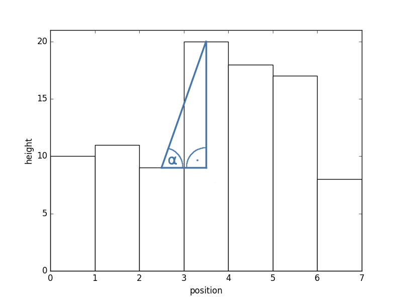

# ORB_SLAM2 ROS Extension

This document describes features added to ORB_SLAM2 by Jan Brehmer, Christopher-Eyk Hrabia and Sebastiano Barrera.

## 1. ROS Interface

This project is forked from https://github.com/sebastiano-barrera/ORB_SLAM2, making the GUI optional, instead providing basic ROS node functionality and topic broadcasts for camera position as `TransformationFrame`, map points as `PointCloud` and the tracking state as `String`.

This set of broadcasts was expanded by the tracking state as `ORBState` enum (see [section 5](#5-orbstate)), the map points as `Octomap` and two different projected 2D maps as `OccupancyGrid` (see [section 4](#4-2d-maps)).

The respective topics are:

* `map`
* `map_updates` (currently visible map points)
* `frame` (status image)
* `state`
* `state_description`
* `octomap`
* `projected_map`
* `gradient_map`


## 2. Catkin package structure

The overall folder structure and CMake files were adjusted to work as a catkin package out-of-the-box.


## 3. Using an Odometry Transformation Frame

It is possible to set a reference TF different from the ORB_SLAM2 base frame (camera) to align the octomap with.
This is especially useful when processing environments with lots of flat and rectangular structure aligned with the orientation of the respective TF (e.g. odometry).


## 4. 2D Maps

### 4.1 Projected (cut) map

An aggregating cut through a z-interval (currently only "minimal height").

### 4.2 Gradient-based map

The octomap is traversed and a heightmap is built, storing the maximum z value for each known (x, y) coordinate.
It is possible to set a maximum height from which on octomap voxels are ignored (e.g. for building indoor maps without the roof).
Since ORB_SLAM2 map points are quite sparse, unknown z entries are eroded by the mean of their known neighbors, if possible.
This process (`erodeNaN`) is repeated `occupancy_gradient_nb_erosions` times, which can be set as a ROS parameter.

To build an occupancy grid from the resulting height map, its slopes are evaluated, which is illustrated in the following figure.



Wherever a slope is less than `occupancy_gradient_low_slope` (in radians), free space is assumed.
If it exceeds `occupancy_gradient_high_slope`, an obstacle is assumed.
Everything inbetween is literally a gray-zone and is interpolated respectively.
Thus, setting `occupancy_gradient_low_slope` = `occupancy_gradient_high_slope` results in a binary occupancy grid.

To get the slopes at all positions, two gradient maps are computed using the horizontal and vertical Scharr filter, which is a high-pass filter using the kernel
```
         [[ -3, 0,  -3],
k = 1/16  [-10, 0, -10],
          [ -3, 0,  -3]]
```
(or flipped by 90° respectively).
Their absolute values are added into a combined gradient map and the corresponding gradient values are computed from slope values using the equation:

`threshold = sin(slope) / cos(slope) * map_resolution`

## 5. ORBState

The tracking state of ORB_SLAM 2 is broadcasted via the topic `state` as an ORBState pseud-enum.
This is a message consisting of an `uint16 state` and the following static constants to be used as an enumerator:
`UNKNOWN`, `SYSTEM_NOT_READY`, `NO_IMAGES_YET`, `NOT_INITIALIZED`, `OK`, `LOST`
